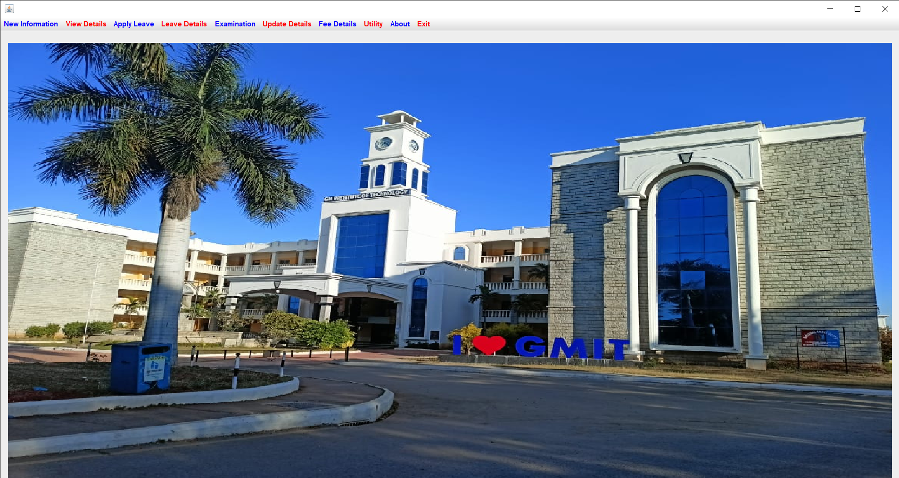

# College Directory Application
## Overview
The College Directory Application is a comprehensive system that consolidates essential resources and administrative tools for a college environment. This application centralizes information for students, faculty, and staff, providing modules for academic records, personal details, fee structure, and more. Built to streamline college operations, it ensures quick access and efficient management of college-related data.

## Features
### User Profiles
AddStudent and AddTeacher: Add and update profiles for students and teachers.
StudentDetails and TeacherDetails: View detailed information for students and teachers.
### Academic Management
EnterMarks and Marks: Input and access student grades and academic progress.
ExaminationDetails: Manage and access examination schedules and information.
### Financial Information
FeeStructure and StudentFeeForm: View and manage fee details for students.
### Leave Management
StudentLeave and TeacherLeave: Modules for leave requests and approvals.
StudentLeaveDetails and TeacherLeaveDetails: View historical leave records for all users.
### Authentication
Login: Secure access for students, faculty, and administrators.
## Technology Stack
Frontend: Java Swing
Backend: Java, JDBC for database connectivity
Database: MySQL
## Folder Structure
```plaintext
College-Directory-Application/
├── build/
│   └── classes/
├── nbproject/
├── src/
│   ├── About.class
│   ├── AddStudent.class
│   ├── AddTeacher.class
│   ├── Conn.class
│   ├── DbUtils.class
│   ├── EnterMarks.class
│   ├── ExaminationDetails.class
│   ├── FeeStructure.class
│   ├── Login.class
│   ├── Marks.class
│   ├── Project.class
│   ├── StudentDetails.class
│   ├── StudentFeeForm.class
│   ├── StudentLeave.class
│   ├── StudentLeaveDetails.class
│   ├── TeacherDetails.class
│   ├── TeacherLeave.class
│   ├── TeacherLeaveDetails.class
│   ├── UpdateStudent.class
│   └── UpdateTeacher.class
├── build.xml
├── manifest.mf
└── README.md
```

## Getting Started
### Clone the Repository:

git clone : https://github.com/madhumaddy77/College-Directory-Application.git
### Database Setup:

Create a MySQL database called college_directory.
Import the provided SQL schema and initial data.
### Run the Application:

Open the project in an IDE (e.g., NetBeans or Eclipse).
Configure any required database credentials in the Conn or DbUtils classes.
Execute Project.class to launch the application.
## Demo Video
- Click to view the demonstration of the application’s features.
[](https://drive.google.com/file/d/1-cCS9NmqbWG4g-RLFzy9AylUo8FyA7PA/view?usp=drive_link)


## Contributions
Contributions are welcome! Please open an issue or submit a pull request if you would like to improve the project.
